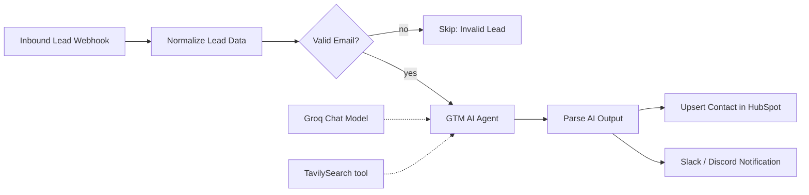

# GTM AI Agent: $0 Lead Enrichment & ICP Scoring with n8n

An n8n workflow that takes an inbound lead, researches the company on the web, scores its fit against your Ideal Customer Profile (ICP), drafts a personalized outreach opener, writes the result to HubSpot, and alerts your sales team in Slack or Discord.

It runs on free tiers only: self-hosted n8n, HubSpot Free CRM, Groq, and Tavily.

## How it works



1. **Webhook** receives a POST with the lead's name, title, email and company.
2. **Normalize** trims and lowercases fields and splits first/last name.
3. **Validation** stops leads with an invalid email address.
4. **Agent** (Groq LLM + Tavily search tool) researches the company, rates ICP fit (`High`, `Medium`, `Low`, `Unknown`) and drafts a 2-sentence opener.
5. **Parse** turns the agent's answer into clean fields. It strips code fences and falls back to `Unknown` if the JSON is broken, so the run never crashes on bad model output.
6. **HubSpot** creates or updates the contact (matched by email) and stores the AI results in custom properties.
7. **Slack/Discord** posts a summary.

## Stack

| Component | Purpose | Cost |
|---|---|---|
| [n8n](https://n8n.io) (self-hosted) | Orchestration | Free |
| [Groq](https://console.groq.com) | LLM inference | Free tier |
| [Tavily](https://tavily.com) | Web search for company research | Free tier |
| HubSpot Free CRM | Contact storage | Free |
| Slack or Discord incoming webhook | Sales alerts | Free |

Free-tier limits change, so check each provider's current limits.

## Setup

### 1. Import the workflows
In n8n: **Workflows → Import from File**, then import both files from `workflows/`:
- `gtm-ai-agent.json` (main workflow)
- `error-handler.json` (optional failure alerts)

### 2. Create credentials
| Credential | Type | Value |
|---|---|---|
| Groq | Groq API | Your Groq API key |
| Tavily | **Header Auth** | Name: `Authorization`, Value: `Bearer <your Tavily key>` |
| HubSpot | HubSpot App Token | Private app token with contacts read/write scopes |

Open each node (Groq Chat Model, TavilySearch, Upsert Contact in HubSpot) and select the matching credential. The IDs in the file are placeholders.

### 3. Create the HubSpot custom properties
In HubSpot: **Settings → Properties → Contact properties → Create property**. Use these internal names exactly:

| Internal name | Field type |
|---|---|
| `icp_fit` | Single-line text |
| `icp_reasoning` | Multi-line text |
| `ai_outreach_draft` | Multi-line text |

### 4. Set your notification webhook
Paste your Slack or Discord incoming webhook URL into the `url` field of **Slack/Discord Notification** (and of **Notify Failure** in the error handler). The body works for both services.

### 5. Edit the ICP definition
Open **GTM AI Agent** and edit the `ICP DEFINITION` section of the system message to describe your own ideal customer.

### 6. Activate
Toggle the workflow to **Active**. To get failure alerts, open the main workflow's **Settings** and choose the error handler under *Error Workflow*.

## Usage

### Input
`POST /webhook/lead` with JSON:

```json
{
  "name": "Anna Test",
  "title": "VP of Sales",
  "email": "anna.test@example.com",
  "company": "Personio"
}
```

### Try it
```bash
# Test mode: click "Execute workflow" first, then send ONE request
curl -i -X POST "http://localhost:5678/webhook-test/lead" \
  -H "Content-Type: application/json" \
  -d @samples/sample-lead.json
```

Or run several leads, with edge cases, against the active workflow:

```bash
bash scripts/send_leads.sh
```

Use fictional people for testing. The sample script uses `@example.com` addresses.

### Output (written to HubSpot and Slack/Discord)
| Field | Description |
|---|---|
| `company_summary` | What the company does |
| `industry` | Industry as found by the search |
| `employee_range` | Approximate size |
| `icp_fit` | `High`, `Medium`, `Low` or `Unknown` |
| `icp_reasoning` | Short justification |
| `outreach_message` | 2-sentence personalized opener |

## Design notes

- **`{query}` is the only placeholder in the Tavily tool.** The LLM fills only the search query. The API key sits in a credential, so the model can never generate or leak it.
- **Max Iterations is 3** and the prompt limits the agent to one search, so a misbehaving model can't loop and burn tokens.
- **Temperature is 0** for stable tool-call arguments.
- **Retries** (3 tries) on the agent, HubSpot and notification nodes absorb short rate-limit hits.
- **Graceful fallback:** invalid or missing AI output results in `icp_fit = Unknown` and a warning in the alert, not a failed run.

## Troubleshooting

| Symptom | Cause and fix |
|---|---|
| `Misconfigured placeholder 'query'` | The placeholder is defined but not used. Make sure the body field `query` has the value `{query}` (single braces). |
| `400 Tool call validation failed` or invalid tool name | Node names should have no spaces (`TavilySearch`). Use body fields ("Using Fields Below"), not raw JSON, so braces aren't parsed as placeholders. |
| `Rate limit reached ... tokens per minute` | Groq free-tier cap. Send leads one at a time, keep Max Iterations at 3, lower `max_results`, or try another model with a higher limit. |
| Webhook returns 404 | In test mode the URL accepts one call per click on *Execute workflow*. For batches, activate the workflow and use `/webhook/`. |
| HubSpot rejects a property | The custom property doesn't exist yet or its internal name differs. See setup step 3. |
| Model flaky with tools | Some models handle tool calling poorly in n8n. This workflow defaults to `llama-3.3-70b-versatile`. Change it in the Groq Chat Model node. |

## Privacy and compliance

This workflow processes personal data (name, email, job title) and sends part of it to third-party services (Groq, Tavily, HubSpot). If you operate in the EU/UK, make sure you have a lawful basis for processing and contacting these people, sign the relevant data processing agreements, and don't auto-send outreach without review. The workflow only **drafts** messages.

## Limitations

- Web search quality depends on how well-known the company is. Small companies often return `Unknown`.
- ICP scoring is an LLM judgment. Treat it as a triage signal, not a decision.
- Node parameters can differ slightly between n8n versions. If an import shows a field warning, re-select the value in the UI.

## License

MIT, see [LICENSE](LICENSE).
